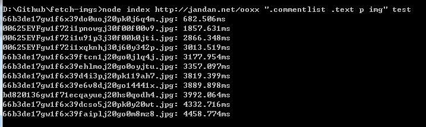

# fetch-imgs
40 行 node.js 代码实现简易的图片爬虫

## 项目地址和效果

项目地址：[fetch-imgs](https://github.com/Lucifier129/fetch-imgs)

效果图：
- 命令行效果
	
- 下载的图片
	

## 项目依赖

- `node-fetch`: fetch api 的 node.js 实现，支持 stream
- `cheerio`: 用 jQuery 式的选择器方式操作 html 字符串
- `async-to-gen`: 轻量级的 async/await 库，支持 Promise-base 的同步语法

## 使用方式

```shell
node index 要爬的页面地址 匹配图片的选择器 图片要保存的文件夹名

node index http://jandan.net/ooxx ".commentlist .text p img" test
```

## 源码解析

### 引入所需的模块

```javascript
var fetch = require('node-fetch')
var cheerio = require('cheerio')
var path = require('path')
var fs = require('fs')
```

### 解析 node.js 启动参数

```javascript
var argv = process.argv// argv[0] === "node"，argv[1] === "index"
var url = argv[2] // 页面地址
var selector = argv[3] // 图片选择器
var folderName = argv[4] || Math.random().toString(36).substr(2, 8) // 目标文件夹名，如不传，生成一个随机名字
var directory = `imgs/${folderName}` // 目标文件路径
fs.mkdirSync(directory) // 以同步的方式创建文件夹
```

### 编写「从 html 内容中解析图片地址列表」的函数

```javascript
function parseImgs(content) {
	var $ = cheerio.load(content) // 把 html 内容用 cheerio 加载为 $
	var imgs = []
	$(selector).each(function(index, img) { // 基本的 jquery 语法，循环遍历所有选择的图片
		imgs.push($(img).attr('src')) // 取出图片的地址，保存在数组
	})
	return imgs // 返回图片地址列表
}
```

### 编写「将线上的图片保存为本地文件」的函数

```javascript
// img 参数为线上的图片地址
async function saveImg(img) { // async 语法，支持同步语法写异步逻辑
	var basename = path.basename(img) // 用 node.js native-api path.basename 解析出图片名
	var filePath = path.join(directory, basename) // 跟目录名拼接在一起，成为图片的本地地址
	
	console.time(basename) // 打上 Log 时间戳
	var res = await fetch(img) // fetch api 返回 promise，可以用 await 兜住
	var writeStream = fs.createWriteStream(filePath) // 创建将图片写入本地文件的流
	writeStream.on('finish', console.timeEnd.bind(console, basename)) // 在写入图片完毕时，输出耗时
	res.body.pipe(writeStream) // 将 read 流以管道 pipe 的方式输入到 write 流
}
```

### 编写最后的主函数

```javascript
// url 为要爬的页面地址
async function fetchContent(url) {
	var res = await fetch(url) // fetch-api 返回 promise，await 兜住，等完成后再执行下面的代码
	var content = await res.text() // fetch-api 的 res.text() 也返回 promise，也用 await 兜住
	var imgs = parseImgs(content) // 解析出图片列表
	imgs.forEach(saveImg) // forEach 一个循环将所有图片保存到本地
}
fetchContent(url) // 调用主函数，开始抓图
.catch(error => console.error(error)) // promise.catch 输出错误日志
```